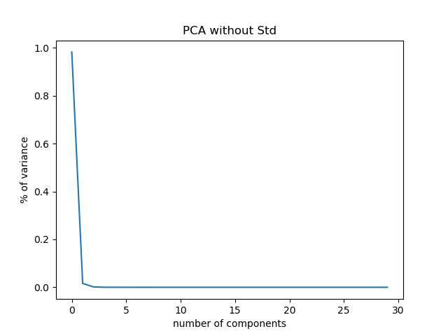
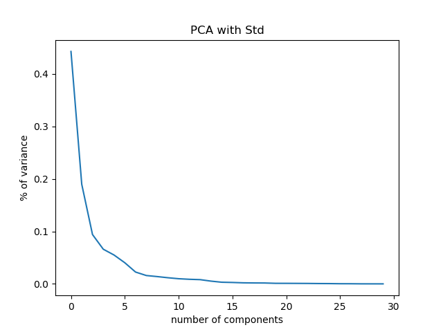
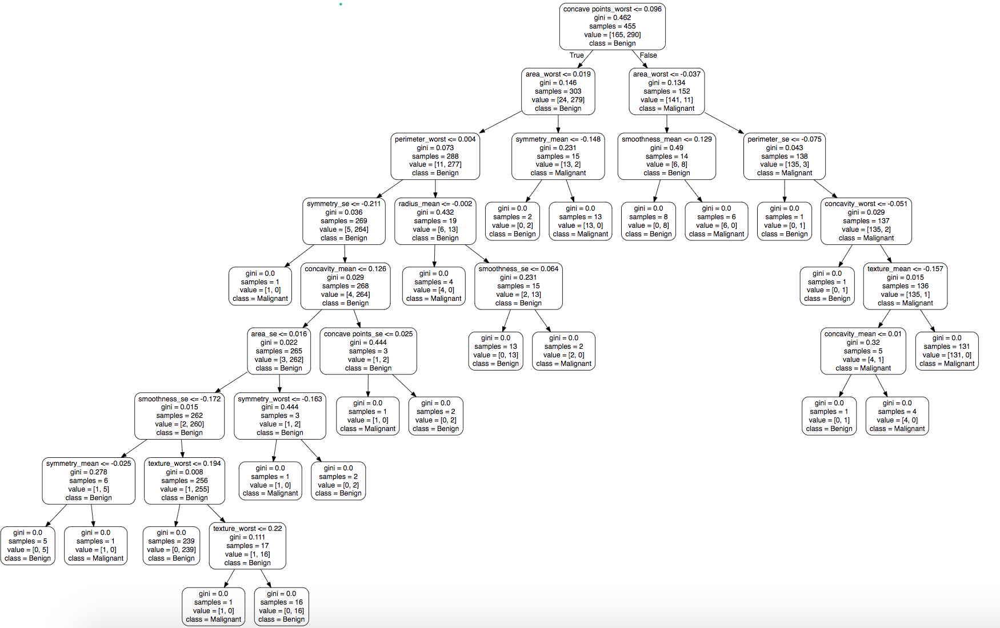
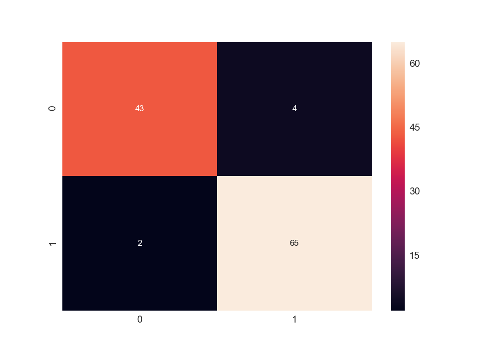
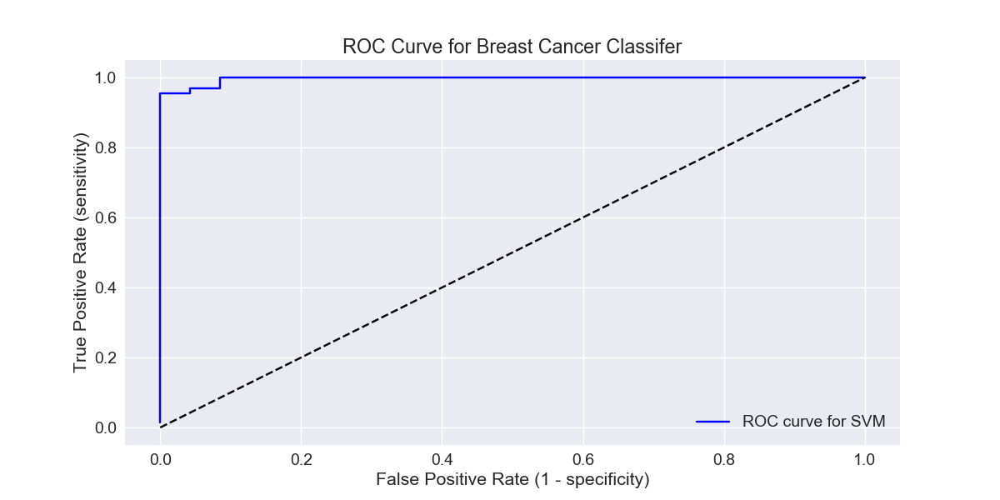

## Breast Cancer Classification using scikit-learn and Keras

## Getting started

First of all you need to make sure you have installed Python 3.6. For that purpose we recommend it has all the necessary libraries except:
* pandas==0.23.4
* seaborn==0.8.1
* Keras==2.2.2
* matplotlib==2.0.2
* numpy==1.14.0
* graphviz==0.8.2
* scikit_learn==0.19.2

All libraries can be installed with the following commands:

```
pip install pandas
pip install seaborn
pip install Keras
pip install matplotlib
pip install graphviz
pip install scikit-learn
```

or quickly:
```
pip install -r requirements.txt
```

## Data

For the project, I used a breast cancer dataset from Wisconsin University.
The dataset contains 569 samples and 30 features computed from digital images.
Each sample identifies parameters of each patient.

## Vizualization Examples

* PCA




* Decision Tree



* Confusion Matrix



* Roc Curve



* Correlation Map


## Contact & Blog post
* Main Autor [Szymon Płotka](https://github.com/simongeek)
* CEO of [Ermlab Software](https://ermlab.com) [Krzysztof Sopyła](https://github.com/ksopyla)
* Check Our blog post [Breast cancer classification using scikit-learn and Keras]()